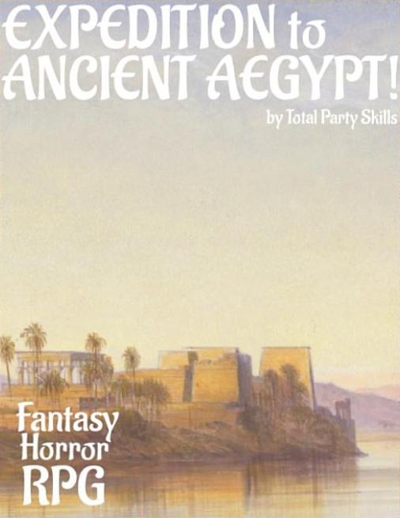

**Heroes of Aegypt RPG Character Generator**
============================================

**Heroes of Aegypt RPG Character Generator** is a Windows program for creating characters using the Total Party Skills system.

Notes
-----

**Heroes of Aegypt RPG Character Generator** is being developed using Python 3.11.6 and PyQt5.

Requirements
------------

* **Windows 11**

  It will also run on Windows 10.

* **Python 3.11.6**
   
   This code was written using the C implementation of Python
   version 3.9.7. Also known as CPython.
   
* **PyQt5 5.15.9**

   PyQt5 is the framework used for displaying the Window GUI and buttons, etc.

* **fpdf2 2.7.5**

   Fpdf2 is needed for printing the character sheets.

Things To-Do
------------

| Continue unifying the skills across all TPS genres.
| Instruction manual.
| Cheat codes.

Known History
-------------

* v0.2.0b

  Compatible with TPS Die Roller 0.5.0.

* v0.1.0b

  Fixed skill and score caps when saving.
  Updated character leveling. Works with latest TPS Die Roller.

* v0.0.1b

  Initial release.

Part of the Expedition to Ancient Aegypt! RPG, written by R. Joshua Holland.
Copyright 2021 - 2022, Total Party Skills.
https://www.drivethrurpg.com/product/371713/Expedition-to-Ancient-Aegypt

Contact
-------
Questions? Please contact shawndriscoll@hotmail.com
